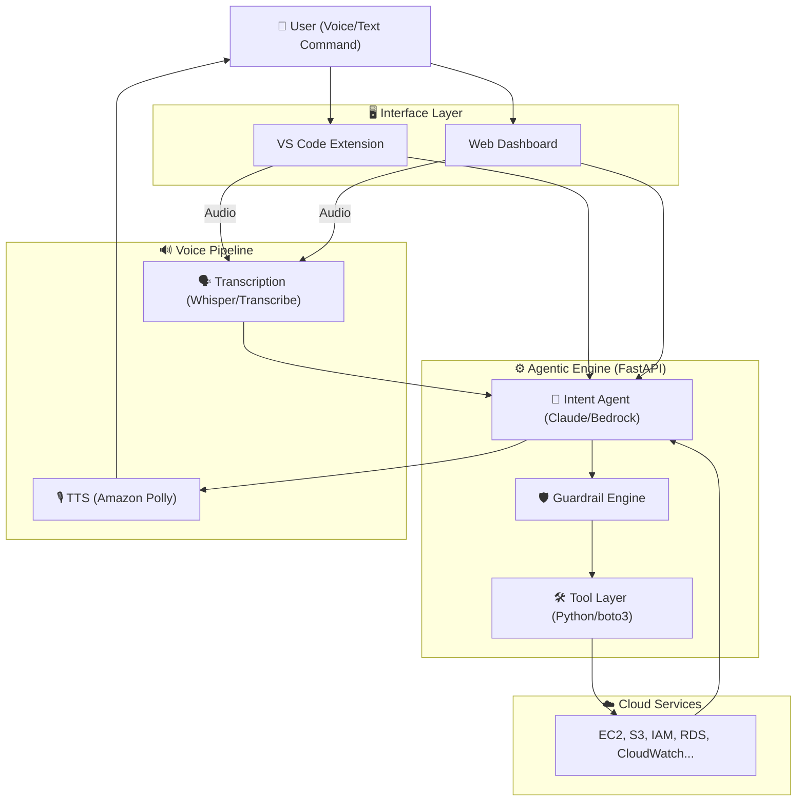

# AWS Cheppu 🎙️

### Voice-Controlled Infrastructure Management

**Speak to your cloud. Let the AI handle the operations.**

**AWS Cheppu** is an agentic AI bridge between human intent and AWS infrastructure. Instead of memorizing CLI flags or navigating complex web consoles, you simply describe your goal—in English or your preferred language—and the agent reasons through, plans, and executes the required AWS operations.

---

## 🏗️ Architecture Diagram



---

## 🚀 The Problem Space

Cloud management today remains trapped in "click-ops" or complex CLI memorization:

* **Cognitive Load:** Finding idle resources or fixing security misconfigurations requires navigating deep sub-menus.
* **CLI Friction:** Complex `aws ec2 describe...` filters are error-prone and hard to remember.
* **Context Switching:** Developers constantly jump between VS Code and the AWS Console, killing productivity.

**AWS Cheppu** changes the paradigm from *writing commands* to *delegating intent*.

---

## 💬 Use Case: Agentic Reasoning

**Scenario:** A developer notices high cloud bills and potential security gaps.

* **You:** "Find all idle EC2 instances and disable port 22 on any public security groups."
* **AWS Cheppu:**
1. *Analyzes* account resources via `boto3`.
2. *Identifies* instances with low CPU usage and public security groups.
3. *Plans:* "I will list EC2 instances, calculate cost impact, and modify the identified Security Groups."
4. *Executes:* "Found 2 idle instances. Applying security policy change to `sg-0abc123`..."
5. *Responds:* "I’ve stopped the idle instances and locked down port 22. You saved ~$40/month."


---

## 🛠️ Tech Stack & Engineering

| Layer | Technology | Engineering Rationale |
| --- | --- | --- |
| **LLM Engine** | Amazon Bedrock (Claude) | Reasoning, tool selection, and intent classification. |
| **Backend** | FastAPI (Python) | High-performance async request handling. |
| **Cloud SDK** | Boto3 | Native integration with all AWS services. |
| **Frontend** | VS Code Extension / React | Context-aware UI inside the editor. |
| **Voice AI** | Polly + Transcribe/Whisper | Real-time, low-latency audio processing. |
| **Infrastructure** | Docker | Consistent environment deployment. |

---

## 📋 MVP Capabilities

### Read Operations (Instant)

* **Cost Management:** "Show me a cost report for the last week."
* **Resource Discovery:** "List all EC2 instances," "Show unattached EBS volumes."
* **Security Audit:** "List all open security groups."

### Write Operations (Human-in-the-loop)

* **Lifecycle Management:** "Stop my dev instances," "Start the database."
* **Security Hardening:** "Disable port 80," "Close SSH access."
* **Networking:** "Create a new VPC," "Setup an Internet Gateway."

> **Safety Guardrail:** All destructive or "Write" operations require an explicit voice confirmation (e.g., "Yes, proceed") before the agent invokes the `boto3` execution layer.

---

## ⚙️ Installation & Setup

### Prerequisites

* Python 3.11+
* Node.js 18+
* AWS CLI (`aws configure`)

### Quick Start

```bash
# 1. Clone & Setup
git clone https://github.com/yourusername/aws-cheppu
cd aws-cheppu/backend

# 2. Environment
cp .env.example .env
# Fill in your AWS region, keys, and settings

# 3. Launch
chmod +x start.sh
./start.sh

```

### Docker Deployment

```bash
docker compose up --build

```

*Access the web UI at `http://localhost:8000`.*

---

## 🛡️ Required IAM Permissions

Add the following to your IAM policy for the agent to function:

* `ec2:Describe*`, `ec2:StopInstances`, `ec2:StartInstances`, `ec2:RevokeSecurityGroupIngress`
* `ce:GetCostAndUsage` (Cost Explorer)
* `bedrock:InvokeModel` (Agentic Reasoning)
* `polly:SynthesizeSpeech` & `transcribe:StartTranscriptionJob`

---

## 💡 What I Learned

Building **AWS Cheppu** was a deep dive into agentic workflows.

1. **Tool Selection vs. Hardcoding:** I learned how to move away from rigid `if/else` logic to an LLM-driven "Tool Layer," where Claude decides which module to call.
2. **Latency Management:** Processing voice to text, to logic, to execution, and back to speech is a complex asynchronous pipeline. Implementing `SSE` (Server-Sent Events) was critical for keeping the UI responsive.
3. **Security First:** Architecting the "Human-in-the-loop" guardrail taught me that in infrastructure management, the AI should be a partner, not a wildcard.

---

## 🔮 Roadmap

* [ ] **Multi-Agent Orchestration:** Dedicated agents for Cost, Security, and Provisioning.
* [ ] **ECS/Lambda Support:** Native voice management for Serverless.
* [ ] **Audit Logs:** Automated logging of every voice command to DynamoDB.
* [ ] **Proactive Alerts:** "Found a spike in costs—should I investigate?"

---

*Built with passion for the cloud. **Speak to your infra, let AWS Cheppu do the rest.***